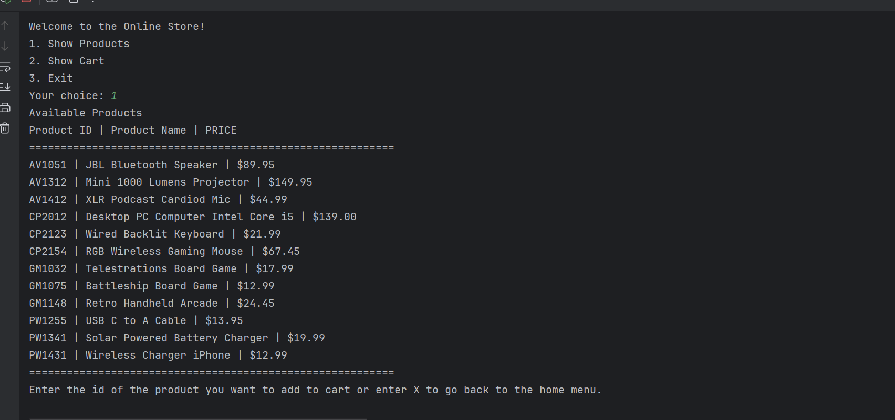

# Project Title

Online Store Console Application

## Description of the Project

This java console application is online store checkout system that allows the user to browser through different
a list of available products, add products to their cart, and complete purchases with receipt being generated
saved locally with a timestamp.

## User Stories

- As a user, I want to be able to view available products , so that I can see all available products.
- As a user, I want to be able to add available products to my cart using product iD, so I can keep track
of products I want to buy.
- As a user, I want to be able to view my shopping carts , so that I can review products and the total cost.
- As a user, I want to be able to proceed to checkout , so that I can complete my purchase.
- As a user, I want to be able to make payment, so that I can pay for my products I check out.
- As a user, I want to receive a digital receipt , so that I can keep a record for my purchases.

## Setup

Follow  the steps below to set up the application.

### Prerequisites

- IntelliJ IDEA: Ensure you have IntelliJ IDEA installed, which you can download from [here](https://www.jetbrains.com/idea/download/).
- Java SDK: Make sure Java SDK is installed and configured in IntelliJ.

### Running the Application in IntelliJ

Follow these steps to get your application running within IntelliJ IDEA:

1. Open IntelliJ IDEA.
2. Select "Open" and navigate to the directory where you cloned or downloaded the project.
3. After the project opens, wait for IntelliJ to index the files and set up the project.
4. Find the main class with the `public static void main(String[] args)` method.
5. Right-click on the file and select 'Run 'YourMainClassName.main()'' to start the application.

## Technologies Used

- Build System: Maven
- Java: JDK 17

## Demo

## Future Work

- Add a function to handle same products being added to the cart
- Improve code readability 

## Resources

- [Potato Sensei](https://chatgpt.com/g/g-681d378b0c90819197b16e49abe384ec-potato-sensei)
- [W3School](https://www.w3schools.com/java/)

## Team Members

- Raymond - Project Management

## Thanks

Express gratitude towards those who provided help, guidance, or resources:

- Thank you to Raymond and potato sensei  for continuous support and guidance.
